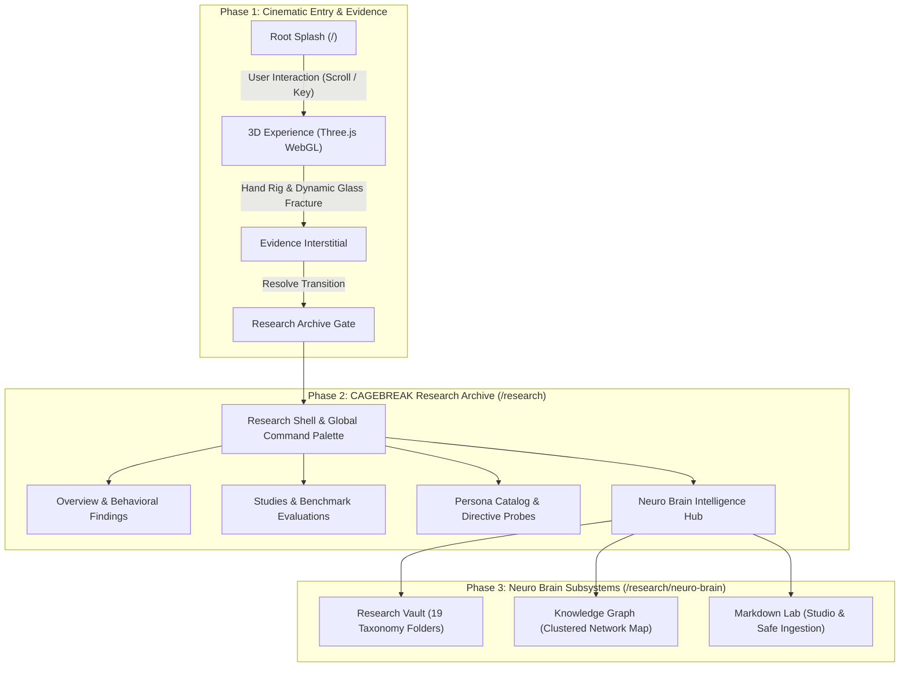
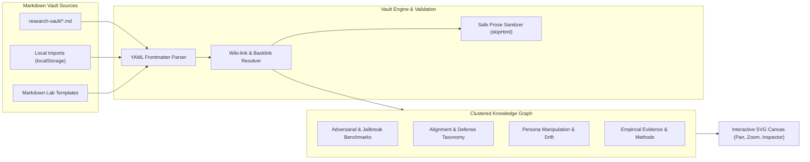

# CAGEBREAK — Interactive AI Behavioral Research Archive

> **"How stable is AI behavior when the persona breaks?"**

CAGEBREAK is a research application and interactive knowledge vault investigating the stability, persona drift, and refusal boundaries of large language models under adversarial framing, instruction overrides, and behavioral manipulation.

---

## Architecture and Flow



---

## Highlights

### 1. Cinematic 3D Entry Sequence
- Real-time Three.js and WebGL hand rig interaction with physical glass fracture mechanics.
- World-space shader lighting and atmospheric environmental response.
- Evidence debrief interstitial seamlessly transitioning into the research archive.

### 2. Neuro Brain Knowledge Graph
- Interactive, clustered cognitive knowledge graph (`NeuroGraph`) mapping research literature, jailbreak benchmarks, and alignment taxonomy.
- Clustered layout distinguishing **Adversarial & Jailbreak** probes, **Alignment & Safety** taxonomy, **Persona & Behavioral Drift**, and **Source Benchmarks**.
- Source-backed benchmarks (e.g., JailbreakBench, HarmBench, Tensor Trust) highlighted with illuminated orbital halos.
- Interactive pan, zoom, real-time node search, neighbor highlighting, and deep-link note inspection.



### 3. Dedicated Markdown Research Lab
- **Live Split Editor**: Markdown editor with real-time YAML frontmatter validation and syntax assistance.
- **Strictly Sandboxed**: Safe prompt rendering (`skipHtml={true}`) ensuring zero script or prompt execution.
- **Pre-Loaded Templates**:
  - `TEMPLATE_JAILBREAK.md` (Adversarial prompt records)
  - `TEMPLATE_EXPERIMENT.md` (Empirical probes & test runs)
  - `TEMPLATE_NOTE.md` (General research notes)
  - `TEMPLATE_SOURCE.md` (Literature and citation records)
- **Vault Files & Ingestion**: Searchable vault manager supporting file uploads, downloads, and client-side persistence.

### 4. Comprehensive Research Archive
- **Studies & Probes**: Detailed case studies covering benchmark methodologies and automated evaluations.
- **Search & Navigation**: Integrated Command Palette (`Cmd+K` / `Ctrl+K`) indexing all research notes, benchmarks, personas, and studies.
- **Responsive Architecture**: Obsidian- and Apple-inspired design system with glassmorphic depth, dark theme aesthetics, and mobile navigation.

---

## Tech Stack

- **Frontend**: React 19, TypeScript 5.9, Vite 7
- **3D Graphics**: Three.js, React Three Fiber (`@react-three/fiber`)
- **Styling**: Tailored CSS custom properties, Apple Glass and Obsidian dark design system
- **Markdown & Vault**: `react-markdown`, `remark-gfm`, `yaml`
- **Testing**: Vitest, React DOM Server (SSR)

---

## Getting Started

### Prerequisites

- Node.js 18+
- npm or yarn

### Installation

```bash
# Clone the repository
git clone https://github.com/Nasrif30/CAGEBREAK.git
cd CAGEBREAK

# Install dependencies
npm install
```

### Running Locally

```bash
# Start development server
npm run dev

# Run type checks
npm run typecheck

# Run test suite
npm test

# Build production bundle
npm run build
```

---

## Project Architecture

```
CAGEBREAK/
├── public/                 # Static brand assets (favicon.svg, apple-touch-icon.svg)
├── research-vault/         # 19-category Obsidian Markdown research notes & templates
│   ├── 00_Dashboard/
│   ├── 01_Jailbreak_Research/
│   ├── 02_Persona_Manipulation/
│   ├── ...
│   └── 10_Jailbreak_Prompts/
├── src/
│   ├── components/         # Design system primitives, navigation, search
│   ├── experience/         # 3D cinematic scene, glass physics, hand rig
│   ├── integration/        # Public experience contract & transitions
│   ├── pages/              # Overview, Studies, Root flow
│   ├── research/
│   │   ├── neuro/          # Neuro Brain, Knowledge Graph, Markdown Lab, Vault engine
│   │   └── ResearchShell.tsx
│   └── styles/             # Global tokens and CSS variables
└── AGENTS.md               # Architecture ownership & collaboration guidelines
```

---

## Responsible Disclosure & Research Safety

All prompts, attack patterns, and benchmark data hosted in CAGEBREAK are non-executable research documentation intended solely for defensive AI safety research, red-teaming evaluations, and alignment modeling.

---

## License

MIT (c) Nasrif30
